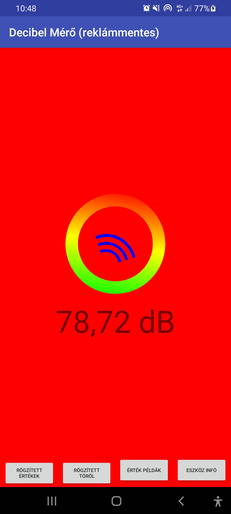

Chat gpt 3.5 and AppBuilder java based decibel meter android application.
The application naturally displays the calculated decibel value according to the specific capabilities of the device used. The application includes a measured maximum and minimum value that is triggered when the application is started and is always updated automatically with the detected maximum and minimum dB value.
The clear button starts this process from the beginning.
After downloading, you can open the zip file in AppBuilder and install the application.

